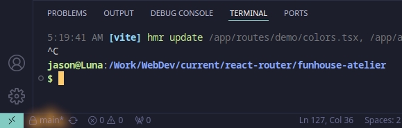

# Git Branches and Pull Requests Guide

## The Branch Button in VS Code

See what I highlighted there? It might say `main` or it might say `master`, but either way it means the same thing, the default branch of the repo. This is also a button, just like the sync button immediately to the right of it. The lock icon to the left of the branch name indicates it is locked, therefore you cannot sync changes to that branch.

## Changing Branches

You can change which branch you are working on to keep your code edits separate from the default branch. Just click that branch button, labeled either `main` or `master`, then VS Code will give you a drop-down of options. At first you must choose `+ Create New Branch` and name it whatever you think is appropriate, but keep it simple and use kebab-case, like you should for the repo name.

You'll see the label on the branch button change to whatever new branch name you chose. You're now working on that branch, and your commits won't touch the default branch, so you're good to go.

## Publishing a New Branch

Now you can make any change you want to the code and commit it to this new branch. Then, when you first try to sync with GitHub the button will say "Publish Branch". Click it and the branch will be synced to GitHub.

## Branch Dropdown Menu

Now let's explore the dropdown menu VS Code gives you when you click the branch button.

### `+ Create new branch from...`

This allows you to choose which existing branch the newly created branch will be a clone of. By default it's the branch you're currently working in.

### `Checkout detached...`

You probably won't have much use for this. Look it up if you're curious.

### `branches` Section

Here is a list of all of the branches in the repo on your computer. If you select a branch here you will switch to that branch. You can have as many branches as you want, even if just to try to do the same thing but 3 different ways. Feel free to create branches and switch between them. Remember that you can create a new branch based on the default branch if you want a clone without any recent changes by you, or you can create a new branch based on the branch you're currently working on, if you decide you want to _fork_ your work, try going in two different directions with it.

### `remote branches` Section

The branches in the cloud, thus synced to GitHub. You don't need to publish and sync every branch on your computer to GitHub. In the end all you need to do is get one branch to be what you want, then make sure that one is published to GitHub and then send a pull request for that branch.

## Submit a Pull Request

So you think your code looks good? The task seems to be done? Ok, then you submit a pull request, which means you request I merge your changes with the default branch. The way to do it in VS Code requires the GitHub Pull Requests extension:

That will **add a new icon to your left sidebar**, and when you click on it there will be a little **Create Pull Request** button, but you might have to hover your mouse near it to make it show up.

Click that button to get a dialog:

Here you see the base branch and your branch of changes to merge into the base branch. You can give it a short message, in my case `test change to test branch`. Like on commits, a brief message is required. Then there's also a field for more detailed commentary if you need it, but that part is strictly optional.

Click the "Create" button and it is done. I'll review your changes.

## Delete a Branch

To delete a branch, open the Source Control sidebar, click on the `...` menu icon and select `Branch > Delete Branch...` from the pop-up menu. VS Code will show you a dropdown menu of local branches you can delete. **You cannot delete the branch you are currently working in,** so you might need to switch branches first.

This will not delete them on GitHub. Once a branch is published to GitHub, it is under my control there, but you don't need to keep branches on your computer after you are finished working in them. If I accept your pull request and merge your branch in, you don't really need it anymore. Have a new task? Start a new branch! That's how it's done, son.
